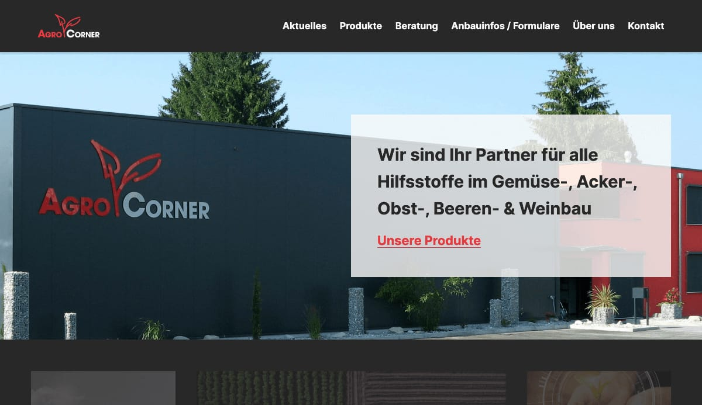

# `agrocorner-theme`

> a custom-tailored theme for [agrocorner](https://agrocorner.ch), built on [automad](https://automad.org). 🖌

toolchain consisting of `eslint`, `esbuild`, `postcss`; written in php, vanilla css and vanilla js.

## local requirements

* `php ^7.4`
* `node >=16`
* `yarn >=1`
